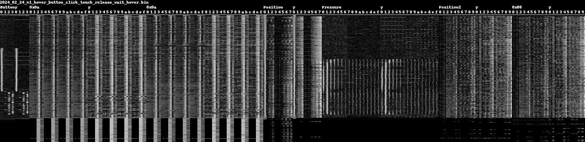
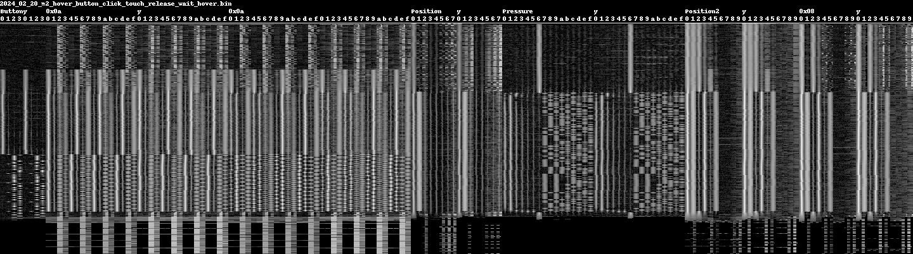
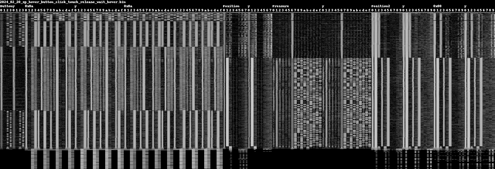
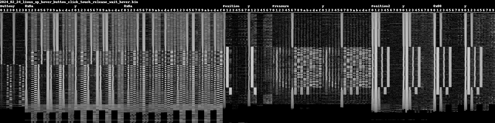

# Analysis on Intel's Touch Host Controller

This host controller is used in the Microsoft Surface Pro 9.

Some notes and discoveries from analysis, goal is mainly to address the button glitching, which causes problems with the Slim Pen 2, also reported [here](https://github.com/quo/iptsd/issues/5), [here](https://github.com/linux-surface/iptsd/issues/102) and [here](https://github.com/linux-surface/iptsd/issues/99).

Help a bit towards reverse engineering the [pen data format](https://github.com/linux-surface/intel-precise-touch/issues/14), and [ipts for surface gen 7](https://github.com/linux-surface/intel-precise-touch/issues/4). Lots of amazing work has been done by the community, none of this here would've been possible without that foundation.

License is GPL, just like [iptsd](https://github.com/linux-surface/iptsd).

Further things to be aware of when reading this document:
- Nothing in this document is to be assumed as accurate or correct, it's all speculative.
- This is a repo I made for myself, information deemed accurate should probably be migrated to the iptsd wiki. Not as PRs into this repo.


I named the images `spectrogram`, while technically incorrect they do look a lot like spectrograms, y axis is time (increasing towards the bottom).
The header contains the filename of the original binary dump file (windows logs are first converted to iptsd dumps).
The order of the dft windows is fixed. The `x` dimension starts at the name of the window, the `y` dimension start is denoted.
The dft rows are thus columns in this representation:


Intensity is scaled based on the highest value in the horizontal image row (so if the entire row is low value noise, it will still show up).

## Structure of this repo

It's a bit of a mess, since this grew organically as I needed new functionality. The important parts are:

- Information on recording on windows can be found [recording_windows.md](recording_windows.md).
- Some patterns for [ImHex](https://github.com/WerWolv/ImHex) can be found at [imhex.md](imhex.md).
- The [ipts.py](ipts.py) file contains parsers for the binary dumps from iptsd (and ithc).
- The [irpmon_thcbase.py](irpmon_thcbase.py) file allows converting a data capture from Windows to a iptsd binary dump file.
- The [print_data.py](print_data.py) file allows creating spectrograms and does some decoding.

## Existing docs

Unfortunately, Microsoft Pen Protocol itself is not a publically available specification, it would make this so much easier... Microsoft did buy the company called `N-Trig`, so reading patents from that company may prove helpful.

- The [fcc report](https://fccid.io/C3K1962) for the slim pen 2, unfortunately this seems to only pertain to the bluetooth aspect.
- [US9018547][US9018547] describes a method of interpolating the position between antenna using a ratio.
- [US8669967][US8669967] describes the idea time slots for use by the screen and pen communication.
- https://github.com/linux-surface/intel-precise-touch/issues/14 Reverse-Engineering Gen7+ Pen Data Format
- https://github.com/linux-surface/intel-precise-touch/issues/4 IPTS on Surface Gen7
- [Pen state transitions](https://learn.microsoft.com/en-us/windows-hardware/design/component-guidelines/windows-pen-states) describes the state diagram for pens in windows. Also describes area of palm rejection.
- The [haptic pen implementation guide](https://learn.microsoft.com/en-us/windows-hardware/design/component-guidelines/haptic-pen-implementation-guide) describes the pages and ids for haptic waveforms.

# Analysis

Okay, so the main goals for me are:

- Get a better understanding of how this all works, what data is there, how is it used, just for learning.
- Fix the button glitching that happens with my Surface Pro 9 and Slim Pen 2.

## Summary of my current understanding

- On Linux, we currently don't get the `0x6e` frame; Perhaps it is in a different mode?
- On Windows, the driver sends a message that has the digitizer id every 2-3 frames.
- On Windows, the Slim Pen 2 does not have the binary pattern in the `0x0a` dft windows.
- On Windows, we see the binary pattern in the `0x0a` dft windows, on Linux we see the same for the Slim Pen 2.
- For all digital data the `x` and `y` signals can be combined into each other.
- The binary pattern in `0x0a` goes away if the barrel button is held, then the rows become alternating each group.
- The DftButton window holds repeating binary patterns in column 2 and 3, column 1 is the marker. This is unique per pen.
- Pressure window `0x07-0x0F` holds a digital representation of the pressure, likely only a delta. Each group holds a full state.
- The first column of the Button DFT window frame is not accurate for MPP 2.0+, 

## Hardware

I obtained a few pens:

- [Microsoft Surface Slim Pen 2](https://www.microsoft.com/en-ca/d/surface-slim-pen-2/8tb9xw8rwc14) (denoted SP) is MPP v2.6, 4096 pressure levels, digitizer ID is `0x97d8f7ad`.
- [Metapen M1](https://metapen.com/products/m1) (denoted M1) is MPP 1.51, 1024 pressure levels
- [Metapen M2](https://metapen.com/products/m2) (denoted M2) is MPP 2.0, 4096 pressure levels

## Data

- Windows data captured using the method described in [recording_windows.md](recording_windows.md).
- Most current data on this page is from captures from Windows. Data sent to the device is NOT visualised.
- Data referred to as `NP` is from [this issue](https://github.com/quo/iptsd/issues/5) where @NP-chaonay linked to a google drive holding recordings of his Slim Pen 2.
- There is a LOT of data, this here mainly focusses on the DFT windows.

## Breakdown of messages captured from Windows

Data recorded using IRPMon. The data comes in with a few individual IRP transactions;

I've called these 'frames', invididual frames hold multiple reports, the reports are the ones we are familiar with from ipts.
From these frames we can create 'groups', I just decided to split those on the last unique window type (`IptsDftWindowPosition2`),
which conveniently worked out well for the `0x6e` frame as we get a mostly black line.

First byte seems to denote the frame type. The multiple reports on the `0x1a` frame is not a bug in the parser,
data actually contains this, and the data is not duplicated, first `IptsDftWindow0x0a` is different from the second.
Should probably change this and group this based on the counter in `IptsPenMetadata` that increments with each group.

This pattern, and the sizes of individual packets are identical between Slim Pen2, Metapen M1, Metapen M2.
Strike that, Slim Pen 2 has `0x6e` as unique frame type, which is sent on the first detection of the pen, it has its own section after this list.

<details>
  <summary>Frame and reports overview</summary>

```
0x1a size: 4318 hexdump: 1a 00 00 de 10 00 00 00 00 00 d7 10 00 00 00 ff 00 00 0b 08 00 00 00 00 00 00 00 00 00 
   0x5f IptsPenMetadata  len: 16  
   0x59 IptsNoiseMetricsOutput  len: 64  
   0x5a IptsDataSelection  len: 148  
   0x5c IptsDftWindow  len: 396  IptsDftWindowButton
   0x62 IptsPenDetection  len: 16  
   0x5f IptsPenMetadata  len: 16  
   0x59 IptsNoiseMetricsOutput  len: 64  
   0x5a IptsDataSelection  len: 148  
   0x5c IptsDftWindow  len: 1548  IptsDftWindow0x0a
   0x62 IptsPenDetection  len: 16  
   0x5f IptsPenMetadata  len: 16  
   0x59 IptsNoiseMetricsOutput  len: 64  
   0x5a IptsDataSelection  len: 148  
   0x5c IptsDftWindow  len: 1548  IptsDftWindow0x0a
   0x62 IptsPenDetection  len: 16  
   0xff IptsTermination  len: 4  
0x0d size: 1982 hexdump: 0d 00 00 be 07 00 00 00 00 00 b7 07 00 00 00 ff 00 00 0b 08 00 00 00 00 00 00 00 00 00 
   0x5f IptsPenMetadata  len: 16  
   0x80   len: 100  
   0x59 IptsNoiseMetricsOutput  len: 64  
   0x5a IptsDataSelection  len: 148  
   0x5e IptsTouchedAntennas  len: 28  
   0x5c IptsDftWindow  len: 1548  IptsDftWindowPressure
   0x62 IptsPenDetection  len: 16  
   0xff IptsTermination  len: 4  
0x0b size: 1374 hexdump: 0b 00 00 5e 05 00 00 00 00 00 57 05 00 00 00 ff 00 00 0b 08 00 00 00 00 00 00 00 00 00 
   0x5f IptsPenMetadata  len: 16  
   0x80   len: 100  
   0x59 IptsNoiseMetricsOutput  len: 64  
   0x5a IptsDataSelection  len: 148  
   0x5c IptsDftWindow  len: 972  IptsDftWindow0x08
   0x62 IptsPenDetection  len: 16  
   0xff IptsTermination  len: 4  
0x0c size: 1750 hexdump: 0c 00 00 d6 06 00 00 00 00 00 cf 06 00 00 00 ff 00 00 0b 08 00 00 00 00 00 00 00 00 00 
   0x5f IptsPenMetadata  len: 16  
   0x57 IptsPenGeneral  len: 64  
   0x80   len: 100  
   0x59 IptsNoiseMetricsOutput  len: 64  
   0x5a IptsDataSelection  len: 148  
   0x5b IptsMagnitude  len: 464  
   0x5e IptsTouchedAntennas  len: 28  
   0x5c IptsDftWindow  len: 780  IptsDftWindowPosition
   0x62 IptsPenDetection  len: 16  
   0xff IptsTermination  len: 4  
0x0b size: 1374 hexdump: 0b 00 00 5e 05 00 00 00 00 00 57 05 00 00 00 ff 00 00 0b 08 00 00 00 00 00 00 00 00 00 
   0x5f IptsPenMetadata  len: 16  
   0x80   len: 100  
   0x59 IptsNoiseMetricsOutput  len: 64  
   0x5a IptsDataSelection  len: 148  
   0x5c IptsDftWindow  len: 972  IptsDftWindowPosition2
   0x62 IptsPenDetection  len: 16  
   0xff IptsTermination  len: 4  
```

</details>

- DataSelection is always before a DFT window.
- PenDetection is always after a DFT window.
- PenGeneral and Magnitude show up in the same block.


Speculating, from patents it seems it is common to have several sections in
each detection cycle. Hunch;

- `IptsDftWindowButton` and `0x1a`: Digital data frames?
- `0x0d`: Pressure is here, perhaps analog frame? Nope

No idea what these frames really denote, because just grouping data. 
It is most likely that these are the individual timeslices during which the pens communicate.
As described in [US8669967][US8669967]. 


In `0x1a`, the magnitude field still matches the center most coefficients, but that is not the highest or single peak.
- Button has 4 rows for both dimensions
- `0x0a` has 16 rows for both dimensions.
- The frequencies never? change in the `0x1a` frame.
- When hovering, button goes to zeros. `0x0a` goes to only having rows `2,3`, `6,7`, `10,11`, `14,15`; Spectrum shows this is noise.
- Rows are consistent, that is; the entire row seems to represent the same data (all 9 bins indicate the same).

## The 0x6e frame

This is a very special frame, in fact it was hidden at first because the frame header is different.
If parsed with the normale frame header the size is large, and we just skip a chunk.


Another revelation; my SP digitizer ID (captured from DigiInfo on Windows) shows up in a `0x6e` HID frame, which seems to have a different header format.

```
0x6e size: 38872 hexdump: 6e ad f7 d8 97 00 00 00 00 00 00 07 00 00 00 ff 00 00 0b 08 00 00 00 00 00 00 00 00 00 
                            |digitizer  |
```

Compare that to:
```
0x0d size:  1982 hexdump: 0d 00 00 be 07 00 00 00 00 00 b7 07 00 00 00 ff 00 00 0b 08 00 00 00 00 00 00 00 00 00 
```

Where the size is in the spot where the current digitizer ID is located, so...
The `0x6e` frame has a special header, because `38872` as size doesn't appear to be right; the reports until `0xff` don't add up.

Adding special handling in the parsing for `0x6e` header, it is 29 bytes long, we obtain the following frame, with the size manually set to `1348`:

```
0x6e size: 1348 hexdump: 6e ad f7 d8 97 00 00 00 00 00 00 07 00 00 00 ff 00 00 0b 08 00 00 00 00 00 00 00 00 00 
   0x5f IptsPenMetadata  len: 16 
   0x80   len: 100 
   0x59 IptsNoiseMetricsOutput  len: 64 
   0x5a IptsDataSelection  len: 148 
   0x5c IptsDftWindow  len: 972 IptsDftWindowPosition2
   0x62 IptsPenDetection  len: 16 
   0xff IptsTermination  len: 4 
0x0d size: 1982 hexdump: 0d 00 00 be 07 00 00 00 00 00 b7 07 00 00 00 ff 00 00 0b 08 00 00 00 00 00 00 00 00 00 
```
The `0x6e` frame sits between the `0x1a` frame and the `0x0d` frame. This frame is sent when the screen detects the pen, it shows up in spectrogram as a black line.


## On DFTs

The phase seems to be having a fairly insigificant role; spectograms can be made with `--color-phase` that visualise the phase
together with the amplitude. Most digital signals appear to be either flipping between rows in the DFT rows, or with an amplitude threshold.


## DftButton

Currently the first row of this DFT frame is used to determine the button state, by combining it with the phase of the position.


- Row 0: unknown, may be button for MPP 1.51, seems to be the case for M1.
- Row 1: Sync marker?
- Row 2/3: One of these is high to represent bit state?

Yeah, this is definitely a repeating bytestream!

For Slim Pen 2, it's a 20 byte repeating pattern most of the time. There's
a few outliers that have different data, rather 153 bits.

For Metapen M2, we see at most two bytes, or rather... 14 bits. More variation
than the slim pen... but it is a repeating pattern of 22 bytes. There's just
more sync markers. Same with the metapen m1, also 22 bytes.

On Slim Pen 2, bit ratio of 1s to 0s is 1.14, metapen m2 is at 1.25. Likely whitened data.


For the slim pen 2 we clearly know the start and end of the transmission.
This sequence doesn't appear to change, even on Linux it is identical to Windows.

For the MetaPen's we don't know where the data starts and stops, but 
if we align the metapen's against the most matching data from the slim pen we obtain:

```
For the Slim Pen 2: 7a 99 ca 56 97 19 1e 58 2d 58 b4 9d 10 77 38 4c d5 12 da 80
For Metapen M2      7f 9c 75 84 6f 7c 63 68 59 30 57 30 4c d4 41 dc 3a 58 31 5c 2f bc 7f 9c 75 84 6f...
For Metapen M1      78 8c 75 84 6d 68 61 7c 59 30 55 24 49 d0 45 c4 3e 40 32 54 2f bc 78 8c 75 84 6d ...
```

From NP data, which is a Slim Pen 2, but a different id
```
NP Slim Pen 2: 79 91 c2 06 a7 99 dc 58 2d 44 f4 9d 10 30 39 50 d5 12 da 80
My Slim Pen 2: 7a 99 ca 56 97 19 1e 58 2d 58 b4 9d 10 77 38 4c d5 12 da 80

Removing identical bytes:
NP Slim Pen 2: 79 91 c2 06 a7 99 dc       44 f4       30 39 50          80
My Slim Pen 2: 7a 99 ca 56 97 19 1e       58 b4       77 38 4c          80
```

Speculation...
- ~Battery level?~ Ruled out, pen at 94% gives same reading, battery is likely through BLE.
- Digitizer id?
- Serial number?

One of the driver blobs mentions `CRC4`, but would first need to figure out the data whitenening.

## IptsDftWindow0x0a

This is a very interesting frame, my hunch is that it is used to convey a unique pen id.

Caveats:
- First 0x0a's row 4 and 5 

### Metapen M1
For Metapen M1, this is always noise.


### Metapen M2
For Metapen M2, while in 'normal' (no buttons pressed) position, this is a repeating pattern (every 6 rows it seems), again with some of the flipping encoding seen in `DftButton`. Could be that it's trying to convey something like a pen id? One of the patents describes something like that.


### Slim Pen 2 Windows

For Slim Pen 2, we do not see an alternating bit pattern in 'normal'. When a button is pressed, almost all channels start flipping with each row.


Interesting thing is that at the initial detection of the Slim Pen 2 (since correcting `0x6e` before the black line), we do see there's data encoded.
This data appears to be identical between fresh pen detects. 

After the initial detection, the `0x6e` frame is sent, and the Windows driver starts sending periodic frames to the hardware that look like this:

```
09 8e a5 15 02 00 00 00 00 ad f7 d8 97 70 17 00
                          |digitizer  |
```

Probalby to communicate to the hardware that the stylus it is still being tracked and it doesn't have to send its 'init' transmission again.

### Slim Pen 2 Linux

It appears to show a pattern similar to the one seen for the Metapen M2 on windows.
It is possible that it falls back to MPP 2.0 functionality in the linux case?
Does this, combined with this screen cause the wavy positions?


## IptsDftWindowPressure

Without a doubt there's binary data in the higher rows, it stays constant at saturated pressure.

- The first 6 rows are not part of the binary data.
- The 7th row is high if there's no pen present, it goes low (lower?) than the 8-16th rows.
- Note that 8-16th is 9 bits, is it one parity? Right most column changes the most often, left values definitely change less.

Not sure how this is encoded yet... if we record pressure, both SP2 and M2 go 0b010101111 when pressure is saturated.


### Saturating pressure on the M1

No digital data to be seen here.


### Saturating pressure on the M2
Digital data quickly reaches stable `0b010101111` state.


### Saturating pressure on the SP

Digital data takes longer to reach `0b010101111` state.


### Pressure thoughts

- Could be encoding the pressure change between transmissions? That would explain why the SP takes longer to transmit its delta.
- Hamming code? Parity bit?
- Clearly not repeating the same data over multiple groups.
- Likely conveys scale together with a value, that would explain why it is still so 'busy' when normal pen motion happens, it's communicating small changes accurately then.
- If this is a delta, the driver needs some way to tell the pen it lost track and it needs to start fresh?

## Detecting Barrel Button & Touch

We introduce the following test sequence:
- Approach the screen.
- Depress the barrel button.
- Touch the screen with the tip of the stylus, button held.
- Move a bit.
- Release the button.
- Retract stylus from screen.


### Barrel test M1

Only the first column of the button dft goes high while the button is held.
After the button is released, we see the digital pattern on column 2 and 3 of the button.



### Barrel test M2



- When the button is pressed, the 0th column of the `Button` Frame does go high, as do most of the `0x0a` dft window columns.
- Interesting bits here is that `Position2`'s 4th column goes high when the button is pressed (compared to 3), and switches to 5 when the screen is touched, but when the button is released, it stays on `5`.
- A strong indicator for barrel present: `0x0a[0]`'s row 5 being higher than 4.
- A strong indicator for screen is touched: `Position`'s row 1 becomes bright, or `Position2` switching from 2 to 3.


### Barrel test SP Windows


- We do see the 0th column of the `Button` frame going high, but it's not nearly as strong as the other binary indicators.
- A strong indicator for barrel present: `0x0a[0]`'s row 5 being higher than 4. (Same as M2)
- A strong indicator for screen is touched: `Position`'s row 1 becomes bright, or `Position2` switching from 2 to 3. (Same as m2)

### Barrel test SP Linux



- Most intriguingly we see a binary signal being transmitted even while the button is held, which is very different from the M2. (is it just xor-ed?)
- A strong indicator for barrel present: `0x0a[0]`'s row 5 being higher than 4. (Same as m2 and SP windows)
- A strong indicator for screen is touched: `Position`'s row 1 becomes bright, or `Position2` switching from 2 to 3. (Same as m2 and SP windows)

### Barrel detection

We get a clear binary signal for the barrel detection with `0x0a[0]`'s row 5 being higher than 4.

Risk here is that if `0x0a` is still used to convey a pen identifier, row 4 and 5 may only be applicable for my pens, not for everyone's, but even [NP-chaonay's PenTouch_StartTest_PressSideKey](media/npchaonay/PenTouch_StartTest_PressSideKey.png) click has the row 4 and 5 switching.

The clearest visual indication is that numerous pairs of rows are switching each group.


## Notes

I've moved my work in progress notes to the [notes.md](notes.md) file.


[US9018547]: https://patents.google.com/patent/US9018547/
[US8669967]: https://patents.google.com/patent/US8669967B2/