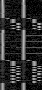

# General

I obtained a few pens:

- [Microsoft Surface Slim Pen 2](https://www.microsoft.com/en-ca/d/surface-slim-pen-2/8tb9xw8rwc14) (SP2) is MPP v2.6, my pen digitizer ID is `0x97d8f7ad`.
- [Metapen M1](https://metapen.com/products/m1) (M1) is MPP 1.51
- [Metapen M2](https://metapen.com/products/m2) (M2) is MPP 2.0


# Breakdown of messages captured from Windows

First byte seems to denote the frame type, not yet sure how this is parsed on the iptsd side.

The multiple records on the `0x1a` frame is not a bug in the parser, data actually contains this, and it appears to be unique.

This pattern, and the sizes of individual packets are identical between Slim Pen2, Metapen M1, Metapen M2. Strike that, Slim Pen 2 has `0x6e` as unique frame type.

```
0x1a size: 4318 hexdump: 1a 00 00 de 10 00 00 00 00 00 d7 10 00 00 00 ff 00 00 0b 08 00 00 00 00 00 00 00 00 00 
   0x5f IptsPenMetadata  len: 16  
   0x59 IptsNoiseMetricsOutput  len: 64  
   0x5a IptsDataSelection  len: 148  
   0x5c IptsDftWindow  len: 396  IptsDftWindowButton
   0x62 IptsPenDetection  len: 16  
   0x5f IptsPenMetadata  len: 16  
   0x59 IptsNoiseMetricsOutput  len: 64  
   0x5a IptsDataSelection  len: 148  
   0x5c IptsDftWindow  len: 1548  IptsDftWindow0x0a
   0x62 IptsPenDetection  len: 16  
   0x5f IptsPenMetadata  len: 16  
   0x59 IptsNoiseMetricsOutput  len: 64  
   0x5a IptsDataSelection  len: 148  
   0x5c IptsDftWindow  len: 1548  IptsDftWindow0x0a
   0x62 IptsPenDetection  len: 16  
   0xff IptsTermination  len: 4  
0x0d size: 1982 hexdump: 0d 00 00 be 07 00 00 00 00 00 b7 07 00 00 00 ff 00 00 0b 08 00 00 00 00 00 00 00 00 00 
   0x5f IptsPenMetadata  len: 16  
   0x80   len: 100  
   0x59 IptsNoiseMetricsOutput  len: 64  
   0x5a IptsDataSelection  len: 148  
   0x5e IptsTouchedAntennas  len: 28  
   0x5c IptsDftWindow  len: 1548  IptsDftWindowPressure
   0x62 IptsPenDetection  len: 16  
   0xff IptsTermination  len: 4  
0x0b size: 1374 hexdump: 0b 00 00 5e 05 00 00 00 00 00 57 05 00 00 00 ff 00 00 0b 08 00 00 00 00 00 00 00 00 00 
   0x5f IptsPenMetadata  len: 16  
   0x80   len: 100  
   0x59 IptsNoiseMetricsOutput  len: 64  
   0x5a IptsDataSelection  len: 148  
   0x5c IptsDftWindow  len: 972  IptsDftWindow0x08
   0x62 IptsPenDetection  len: 16  
   0xff IptsTermination  len: 4  
0x0c size: 1750 hexdump: 0c 00 00 d6 06 00 00 00 00 00 cf 06 00 00 00 ff 00 00 0b 08 00 00 00 00 00 00 00 00 00 
   0x5f IptsPenMetadata  len: 16  
   0x57 IptsPenGeneral  len: 64  
   0x80   len: 100  
   0x59 IptsNoiseMetricsOutput  len: 64  
   0x5a IptsDataSelection  len: 148  
   0x5b IptsMagnitude  len: 464  
   0x5e IptsTouchedAntennas  len: 28  
   0x5c IptsDftWindow  len: 780  IptsDftWindowPosition
   0x62 IptsPenDetection  len: 16  
   0xff IptsTermination  len: 4  
0x0b size: 1374 hexdump: 0b 00 00 5e 05 00 00 00 00 00 57 05 00 00 00 ff 00 00 0b 08 00 00 00 00 00 00 00 00 00 
   0x5f IptsPenMetadata  len: 16  
   0x80   len: 100  
   0x59 IptsNoiseMetricsOutput  len: 64  
   0x5a IptsDataSelection  len: 148  
   0x5c IptsDftWindow  len: 972  IptsDftWindowPosition2
   0x62 IptsPenDetection  len: 16  
   0xff IptsTermination  len: 4  

```

- DataSelection is always before a DFT window.
- PenDetection is always after a DFT window.
- PenGeneral and Magnitude show up in the same block.


Speculating, from patents it seems it is common to have several sections in
each detection cycle. Hunch;

- `IptsDftWindowButton` and `0x1a`: Digital data frames? Fore 
- `0x0d`: Pressure is here, perhaps analog frame?


In `0x1a`, the magnitude field still matches the center most coefficients, but that is not the highest or single peak.
- Button has 4 rows for both dimensions
- `0x0a` has 16 rows for both dimensions.
- The frequencies never change in the `0x1a` frame.
- When hovering, button goes to zeros. `0x0a` goes to only having rows `2,3`, `6,7`, `10,11`, `14,15`
- Rows are consistent, that is; the entire row seems to represent the same data.

## The 0x6e frame
Another revelation, my digitizer ID shows up in a `0x6e` HID frame, which seems to have a different header format;

```
0x6e size: 38872 hexdump: 6e ad f7 d8 97 00 00 00 00 00 00 07 00 00 00 ff 00 00 0b 08 00 00 00 00 00 00 00 00 00 
```

Compare that to:
```
0x0d size:  1982 hexdump: 0d 00 00 be 07 00 00 00 00 00 b7 07 00 00 00 ff 00 00 0b 08 00 00 00 00 00 00 00 00 00 
```

Where the size is in the spot where the current digitizer ID is located, so...
The `0x6e` frame has a special header, because `38872` as size doesn't appear to be right; the reports until `0xff` don't add up.

Adding special handling in the parsing for `0x6e`, we obtain the following frame, with the size manually set to `1348`:

```
0x6e size: 1348 hexdump: 6e ad f7 d8 97 00 00 00 00 00 00 07 00 00 00 ff 00 00 0b 08 00 00 00 00 00 00 00 00 00 
   0x5f IptsPenMetadata  len: 16 
   0x80   len: 100 
   0x59 IptsNoiseMetricsOutput  len: 64 
   0x5a IptsDataSelection  len: 148 
   0x5c IptsDftWindow  len: 972 IptsDftWindowPosition2
   0x62 IptsPenDetection  len: 16 
   0xff IptsTermination  len: 4 
0x0d size: 1982 hexdump: 0d 00 00 be 07 00 00 00 00 00 b7 07 00 00 00 ff 00 00 0b 08 00 00 00 00 00 00 00 00 00 
```
The `0x6e` frame sits between the `0x1a` frame and the `0x0d` frame.


## DftButton

Currently the first row of this DFT frame is used to determine the button state, by combining it with the phase of the position.

I don't think this is the button in the first column, it does transfer binary data though:



- Row 0: unknown, may be button for MPP 1.51, seems to be the case for M1.
- Row 1: Sync marker?
- Row 2/3: One of these is high to represent bit state?

Yeah, this is definitely a repeating bytestream!


For Slim Pen 2, it's a 20 byte repeating pattern most of the time. There's
a few outliers that have different data, rather 153 bits.

For Metapen M2, we see at most two bytes, or rather... 14 bits. More variation
than the slim pen... but it is a repeating pattern of 22 bytes. There's just
more sync markers. Same with the metapen m1, also 22 bytes.

On Slim Pen 2, bit ratio of 1s to 0s is 1.14, metapen m2 is at 1.25. Likely whitened data.

For the slim pen 2 we clearly know the start and end of the transmission.
If we align the metapen's against the most matching data from the slim pen, we get:

For the Slim Pen 2:
```
7a 99 ca 56 97 19 1e 58 2d 58 b4 9d 10 77 38 4c d5 12 da 80
```
This doesn't appear to change, one of the first data captures I have has the exact same (even from linux).

For Metapen M2, we don't really know where the signal stops and starts.
```
7f 9c 75 84 6f 7c 63 68 59 30 57 30 4c d4 41 dc 3a 58 31 5c 2f bc 7f 9c 75 84 6f...
```

For Metapen M1, same story.
```
78 8c 75 84 6d 68 61 7c 59 30 55 24 49 d0 45 c4 3e 40 32 54 2f bc 78 8c 75 84 6d ...
```


Ah, on the metapen m2, we do see the first column of the Button Dft window go high.


For the metapen m1, we do see that the first column matches the button signal.
For the Slim Pen 2 and Metapen M2 however, the first column does change in strength,
main thing seen however is that we see the 'data' dft's go alternating.

Speculation...
- Battery level?
- Digitizer id?
- Serial number?

We've got pretty much nothing to go on for this one though.

## IptsDftWindow0x0a

### Metapen M1
For Metapen M1, this is always noise.

### Metapen M2
For Metapen M2, while in 'normal' (no buttons pressed) position, this is a repeating pattern (every 6 rows it seems), again with some of the flipping encoding seen in `DftButton`. Could be that it's trying to convey something like a pen id? One of the patents describes something like that.


### Slim Pen 2 Windows


For Slim Pen 2, we do not see an alternating bit pattern in 'normal', need to check if there's soome FSK going on though. When a button is pressed, almost all channels start flipping with each row.

Interesting thing is that at the initial detection of the Slim Pen 2, we do see there's data encoded. This data appears to be identical between fresh pen detects.

Perhaps there's some handshake happening at the start that contains the pen id? The first column of `DftButton` seems to go high at the end of the handshake, with one very weird row. The first 16 

Looking at recordings from Linux, we do see that alternating pattern on the data lines here! (`semicircle.bin`).

Ooh... insight! From DigiInfo (not in the xmls) I spotted;
```
  Transducer Serial:
    0x97d8f7ad
  Transducer Vendor:
    0x0000045e (MS HID id)
```

That `0x97d8f7ad` id is the id that is sent by the windows driver to the screen! In the full irp log drivers we saw windows send data to the touch screen when the pen was used... So on Linux the pen and touch screen is operating in a different mode?

Found the digitizer ID in the windows irp logs. It's in a special frame. It is likely decoded by the touch screen? We do see the repeating pattern on `0x0a` when the pen is first brought close.

Current speculation, needs checking is that the windows driver begins sending that 
```
09 8e a5 15 02 00 00 00 00 ad f7 d8 97 70 17 00
```

Request to the hardware to let the stylus know it is still being tracked and it doesn't have to send its 'init' transmission again.

### Slim Pen 2 Linux

It appears to show a pattern similar to the one seen for the Metapen M2 on windows. It is possible that it falls back to MPP 2.0 functionality in the linux case? Does this, combined with this screen cause the wavy positions?

## IptsDftWindowPressure

This isn't only pressure? Looks to be some binary code in there as well for M2 and SP2?

## IptsPenGeneral
64 bytes
```
 50 4e 4a 00 9a 99 99 41  49 9e 00 00 00 00 01 02 FF FF ...
|A          |------------|seq        |--------|  |------
```
A: 16 bit counter:
  - Slim pen 2 increments at 288207-288358
  - Metapen M1 increments at 287894-289429
  - Metapen M2 increments at 287894-288279
Seq; Counter only got below 16 bit counts in recording. Seq matches IptsPenMetadata.C


## IptsPenMetadata
16 bytes
```
 23 9d 00 00 01 06 06 01 ff ff ff ff ff ff ff ff
|C          |T |R |------------------------------
```
- C: Increments, but only every 7 entries, This matches seq from IptsPenGeneral.
- T: C increments if this is `0x01`, sequence is             `0x01, 0x04, 0x02, 0x05, 0x06, 0x0a, 0x0d`
- R: Follows C? T at `0x01` has this at `0x06`, sequence is: `0x06, 0x07, 0x09, 0x0a, 0x0a, 0x0b, 0x08`

No differences between the pens.

## IptsPenDetection
16 bytes
```
 10 0c 01 00 c8 13 01 00 01 00 00 00 02 0d 08 80 
| D1  |F1|--| D2  |F2|.... Fn...
```
D1 and D2 seem to be values relating to each other.
Unique D1 & D2 pairs, for Metapen M1:
```
  920    328 
 1100      0 
 2200      0 
 5652   5012 
12352  20256 
16561  23666 
19365  18728 
22608  20048 
32998  32850 
38730  37456 
63804   8256 
```

For Metapen M2 and Slim Pen 2:
```
  920    328 
 1100      0 
 2200      0 
 3088   5064 
 5652   5012 
12352  20256 
16561  23666 
19365  18728 
22608  20048 
32998  32850 
38730  37456 
63804   8256 
65103   2064 
```

## IptsMagnitude
```
 2A 13 29 14 01 FF FF FF 00 00 .. u32[n]?
|x1|y1|x2|y2|-----------| u32 x[IPTS_COLUMNS + 2] ... | u32[2] (0x00) | u32 y[IPTS_ROWS + 2]
```
- x1 and x2 are always one apart, order varies. They can go to 255 (pen raised?)
- y1 and y2 are always one apart, order varies. They can go to 255 (pen raised?)
- Are these measurement strength, one of the patents refers to ratio of the two hightest bins for positioning.

```
./irpmon_thcbase.py comparison  --limit 1000  ../irp_logs_thcbase/2024_02_11_irp_thcbase_diginfo_3pen/2024_02_11_irp_thcbase_slim_pen_2.log.gz ../irp_logs_thcbase/2024_02_11_irp_thcbase_diginfo_3pen/2024_02_11_irp_thcbase_metapen_m1.log.gz ../irp_logs_thcbase/2024_02_11_irp_thcbase_diginfo_3pen/2024_02_11_irp_thcbase_metapen_m2.log.gz
```

## IptsTouchedAntennas
All zeros in this, but my recordings have pure pen. Seems to again hold C =from IptsPenMetadata, perhaps packed bitmask?

## IptsDataSelection
Depends on the DFT window, third byte from the end is dft window type. From [imhex.md](./imhex.md):

For the majority of frames, the beginning holds the 16 magnitudes for x and y. The end block is always 12 bytes and holds the dft window type.

```
match (dft.data_type) {
  (0x06): datasel_outer<datasel_0x06> data @ addressof(pad);
  (0x07): datasel_outer<datasel_allmag> data @ addressof(pad);
  (0x0a): datasel_outer<datasel_allmag> data @ addressof(pad);
  (0x0b): datasel_outer<datasel_allmag> data @ addressof(pad);
  (0x08): datasel_outer<datasel_0x08> data @ addressof(pad);
  (_): datasel_outer<datasel_unknown> data @ addressof(pad);
} 
```
`0x06` is the position dft window, so the most interesting anyways.

```
struct datasel_end {
    u32 something[2];
    u8 indices[8];
    u8 _pad;
    u8 dft_type;
    u8 _01;
    u8 _ff;
};

struct datasel_pos_dim{
    u32 something[6];
    u32 mag_x0;
    u32 something2[2];
    u32 mag_x1[7];

};

struct datasel_0x06 {
  datasel_pos_dim x;
  datasel_pos_dim y;
  datasel_end info;
};
```
